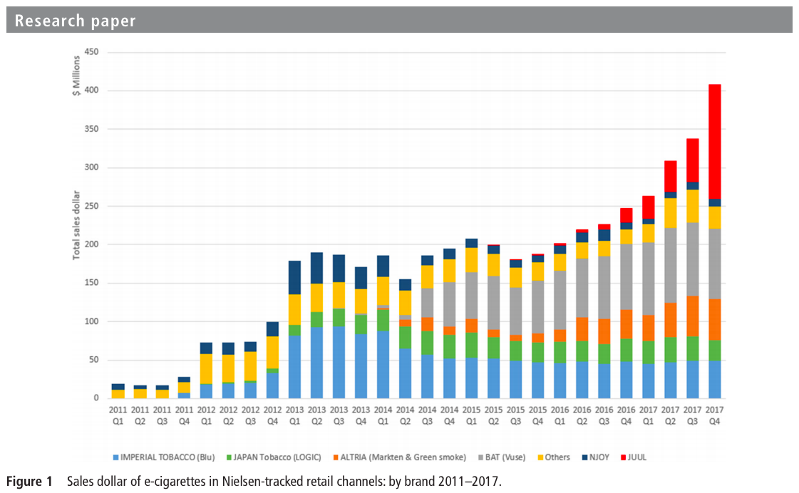

# Must do

- Improve spacings {e.g. SHIFT + RETURN}
- Ensure document follows a reasonable data science + epidemiologic trajectory 

# Overview

<p style="color:red">This study has four underlying questions. Briefly: Among American youth, how has nicotine use (vaping and non-vaping-related) changed over time? What brands are currently used the most frequently?</p>

Questions:

- How has tobacco/nicotine use by American youth changed since 2015?

- How have vaping rates influenced tobacco/nicotine use?

- How do vaping rates compare between males and females?

- What vaping brands and flavors appear to be used the most frequently?
    - Q40: During the past 30 days, what brand of e-cigarettes did you usually use? 

References:

- [Article in Frontiers of Pharmacology](https://www.frontiersin.org/articles/10.3389/fphar.2019.01619/full)

- [Morbidity and Mortality Weekly Report](https://www.cdc.gov/mmwr/volumes/68/wr/mm6806e1.htm?s_cid=mm6806e1_w)

- [Statista Visualization](https://www.statista.com/statistics/881837/vaping-and-electronic-cigarette-use-us-by-gender/)

Must do:

- Make folder

- Get data (2015-Present)

- Get codebooks (2015-Present)

# Libraries

<p style="color:red">We used the tidyverse and readxl packages for simplicity</p>

```{r}
library(tidyverse)
library(readxl)
```

# Data import

# Data wrangling

## Codebooks

<p style="color:red">Would it be worthwhile to manually create a separate codebook that we could include as an image in the markdown? This would make our efforts with the codebooks, and thereby the code we include in this case study, more easily understood.</p>

## Datasets

<p style="color:red">read_excel is used to import the data. Although this is pretty slow.</p>

```{r}
start_time_a <- Sys.time()

data_2015 <- read_excel("2015-nyts-dataset-and-codebook-microsoft-excel/nyts2015.xlsx")
data_2016 <- read_excel("2016-nyts-dataset-and-codebook-microsoft-excel/nyts2016.xlsx")
data_2017 <- read_excel("2017-nyts-dataset-and-codebook-microsoft-excel/nyts2017.xlsx")
data_2018 <- read_excel("2018-nyts-dataset-and-codebook-microsoft-excel/nyts2018.xlsx")
data_2019 <- read_excel("2019-nyts-dataset-and-codebook-microsoft-excel/nyts2019.xlsx")

end_time_a <- Sys.time()

test_a_time <- end_time_a - start_time_a

time_message <- paste("Duration of data import:",
      round(as.numeric(test_a_time),1),
      units(test_a_time)
      )
```

<p style="color:red">`r time_message`</p>

```{r}
dim(data_2015)
dim(data_2016)
dim(data_2017)
dim(data_2018)
dim(data_2019)
```

<p style="color:red">Each year of data was prepared prior for a join. The starts_with() function, suggested by Carrie, was particularly useful for making the code more legible.</p>

```{r}
data_2015 <- data_2015 %>%
    dplyr::select(Qn2,
                  starts_with("E"),
                  starts_with("C"),
                  -EFLAVCIGTS,
                  -CFLAVCIGTS,
                  -EFLAVCIGAR,
                  ) %>%
    rename(female=Qn2) %>%
    mutate(brand_ecig=NA,
           menthol=NA,
           clove_spice=NA,
           fruit=NA,
           chocolate=NA,
           alcoholic_drink=NA,
           candy_dessert_sweets=NA,
           other=NA,
           no_use=NA) %>%
    mutate(year=2015)
```

<p style="color:red">Each year of data was summarised with the summary() function. This made recoding more easily understood in the next step.</p>

```{r}
sapply(data_2015, function(x)
    summary(
        factor(x)
        )
    )
```

<p style="color:red">Each year of data was recoded with the recode() function. Syntax is updated. </p>

```{r}
#Note about difference between recode and fct_recode
data_2015 <- data_2015 %>%
    mutate(female=recode(female,
                      `1`= FALSE,
                      `2` = TRUE,
                      .missing=NA)) %>%
    mutate_at(vars(ECIGT:CBIDIS),
              list(~recode(.,
                           `1` = TRUE,
                           `2` = FALSE,
                           .missing=NA)))
```

<p style="color:red">The above process was repeated for each year of data using information gathered from the codebooks.</p>

```{r}
data_2016 <- data_2016 %>%
    dplyr::select(Q2,
                  starts_with("E"),
                  starts_with("C"),
                  -EFLAVCIGAR,
                  Q50A, #Menthol # What flavors of tobacco products have you used in the past 30 days? (Select one or more)
                  Q50B, #Clove or spice
                  Q50C, #Fruit
                  Q50D, #Chocolate
                  Q50E, #Alcoholic Drink
                  Q50F, #Candy/Desserts/Other Sweets
                  Q50G, #Some Other Flavor Not Listed Here
                  Q50H #I Did Not Use Flavored Tobacco Products In the Past
                  ) %>%
    rename(female=Q2,
           menthol=Q50A,
           clove_spice=Q50B,
           fruit=Q50C,
           chocolate=Q50D,
           alcoholic_drink=Q50E,
           candy_dessert_sweets=Q50F,
           other=Q50G,
           no_use=Q50H) %>%
    mutate(brand_ecig=NA,
           year=2016)

sapply(data_2016, function(x)
    summary(
        factor(x)
        )
    )

data_2016 <- data_2016 %>%
    mutate(female=recode(female,
                      `1`= FALSE,
                      `2` = TRUE,
                      .default = NA,
                      .missing = NA)) %>%
    mutate_at(vars(ECIGT:CBIDIS),
              list(~recode(.,
                           `1` = TRUE,
                           `2` = FALSE,
                           .missing = NA))) %>%
    mutate_at(vars(menthol:no_use),
              list(~recode(.,
                           `1` = TRUE,
                           .missing = FALSE)))
```

```{r}
data_2017 <- data_2017 %>%
    dplyr::select(Q2,
                  starts_with("E"),
                  starts_with("C"),
                  CBIDIS,
                  Q50A, #Menthol # What flavors of tobacco products have you used in the past 30 days? (Select one or more)
                  Q50B, #Clove or spice
                  Q50C, #Fruit
                  Q50D, #Chocolate
                  Q50E, #Alcoholic Drink
                  Q50F, #Candy/Desserts/Other Sweets
                  Q50G, #Some Other Flavor Not Listed Here
                  Q50H #I Did Not Use Flavored Tobacco Products In the Past
                  ) %>%
    rename(female=Q2,
           menthol=Q50A,
           clove_spice=Q50B,
           fruit=Q50C,
           chocolate=Q50D,
           alcoholic_drink=Q50E,
           candy_dessert_sweets=Q50F,
           other=Q50G,
           no_use=Q50H) %>%
    mutate(brand_ecig=NA,
           year=2017)

sapply(data_2017, function(x)
    summary(
        factor(x)
        )
    )

data_2017 <- data_2017 %>%
    mutate(female=recode(female,
                      `1`= FALSE,
                      `2` = TRUE,
                      .default = NA,
                      .missing = NA)) %>%
    mutate_at(vars(ECIGT:CBIDIS),
              list(~recode(.,
                           `1` = TRUE,
                           `2` = FALSE,
                           .missing = FALSE))) %>%
    mutate_at(vars(menthol:no_use),
              list(~recode(.,
                           `1` = TRUE,
                           .missing = FALSE)))
```

```{r}
data_2018 <- data_2018 %>%
    dplyr::select(Q2,
                  starts_with("E"),
                  starts_with("C"),
                  Q50A, #Menthol # What flavors of tobacco products have you used in the past 30 days? (Select one or more)
                  Q50B, #Clove or spice
                  Q50C, #Fruit
                  Q50D, #Chocolate
                  Q50E, #Alcoholic Drink
                  Q50F, #Candy/Desserts/Other Sweets
                  Q50G, #Some Other Flavor Not Listed Here
                  Q50H #I Did Not Use Flavored Tobacco Products In the Past
                  ) %>%
    rename(female=Q2,
           menthol=Q50A,
           clove_spice=Q50B,
           fruit=Q50C,
           chocolate=Q50D,
           alcoholic_drink=Q50E,
           candy_dessert_sweets=Q50F,
           other=Q50G,
           no_use=Q50H) %>%
    mutate(brand_ecig=NA,
           year=2018)

sapply(data_2018, function(x)
    summary(
        factor(x)
        )
    )

data_2018 <- data_2018 %>%
    mutate(female=recode(female,
                      `1`= FALSE,
                      `2` = TRUE,
                      .default = NA,
                      .missing = NA)) %>%
    mutate_at(vars(ECIGT:CBIDIS),
              list(~recode(.,
                           `1` = TRUE,
                           `2` = FALSE,
                           .missing = FALSE))) %>%
    mutate_at(vars(menthol:no_use),
              list(~recode(.,
                           `1` = TRUE,
                           .missing = FALSE)))
```

```{r}
data_2019 <- data_2019 %>%
    dplyr::select(Q2,
                  starts_with("E"),
                  starts_with("C"),
                  -EHTP,
                  -CHTP,
                  Q40, #Brang, e-cigarettes
                  Q62A, #Menthol # What flavors of tobacco products have you used in the past 30 days? (Select one or more)
                  Q62B, #Clove or spice
                  Q62C, #Fruit 
                  Q62D, #Chocolate
                  Q62E, #Alcoholic Drink
                  Q62F, #Candy/Desserts/Other Sweets
                  Q62G, #Some Other Flavor Not Listed Here 
                  )  %>%
    rename(brand_ecig=Q40,
           female=Q2,
           menthol=Q62A,
           clove_spice=Q62B,
           fruit=Q62C,
           chocolate=Q62D,
           alcoholic_drink=Q62E,
           candy_dessert_sweets=Q62F,
           other=Q62G) %>%
    mutate(no_use="missing") %>%
    mutate(year=2019)

sapply(data_2019, function(x)
    summary(
        factor(x)
        )
    )

data_2019 <- data_2019 %>%
    mutate(female=recode(female,
                      `1`= FALSE,
                      `2` = TRUE,
                      .default = NA)) %>%
    mutate_at(vars(ECIGT:CBIDIS), list(~recode(.,
                                               `1` = TRUE,
                                               `2` = FALSE,
                                               .default = NA))) %>%
    mutate(brand_ecig = replace(brand_ecig, brand_ecig %in% c(".N",".S",".Z"), NA)) %>%
    mutate(brand_ecig = recode(brand_ecig,
                                             `1` = "Other", #levels 1,8 combined to `Other` 
                                             `2` = "Blu",
                                             `3` = "JUUL",
                                             `4` = "Logic",
                                             `5` = "MarkTen",
                                             `6` = "NJOY",
                                             `7` = "Vuse",
                                             `8` = "Other")) %>%
    mutate_at(vars(menthol:no_use),
              list(~recode(.,
                           `1` = TRUE,
                           `.S` = FALSE,
                           .default = NA,
                           .missing = NA)))

data <- data_2015 %>%
    rbind(data_2016) %>%
    rbind(data_2017) %>%
    rbind(data_2018) %>%
    rbind(data_2019)

sapply(data, class)

sapply(data, function(x)
    summary(
        factor(x)
        )
    )
```

# Question 1 

<p style="color:red">How has tobacco/nicotine use by American youth changed since 2015?</p>

<p style="color:red">Below is a figure I created to demonstrate the change over the years for both current and ever use.</p>

```{r, fig.width=7, fig.height=7}
data %>%
    dplyr::select(year, ECIGT:EBIDIS, CCIGT:CBIDIS) %>%
    mutate(tobacco_sum_ever = select(., ECIGT:EBIDIS) %>%
               apply(1, sum, na.rm=TRUE),
           tobacco_sum_current = select(., CCIGT:CBIDIS) %>%
               apply(1, sum, na.rm=TRUE)) %>%
    mutate(tobacco_ever = case_when(tobacco_sum_ever > 0 ~ TRUE,
                                    tobacco_sum_ever ==0 ~ FALSE),
           tobacco_current = case_when(tobacco_sum_current > 0 ~ TRUE,
                                    tobacco_sum_current ==0 ~ FALSE)) %>%
    group_by(year) %>%
    summarise(tobacco_ever_year=sum(tobacco_ever, na.rm = TRUE)*100/sum(!is.na(tobacco_ever)),
              tobacco_current_year=sum(tobacco_current, na.rm = TRUE)*100/sum(!is.na(tobacco_current))) %>%
    rename("Ever"=tobacco_ever_year,
           "Current"=tobacco_current_year) %>%
    gather(key=Use,
           value=Percentage,
           -year) %>%
    ggplot(aes(x=year,y=Percentage, color=Use)) +
    geom_point() +
    geom_line() + 
    scale_y_continuous(breaks = seq(0,50,by=5),
                       labels = seq(0,50,by=5),
                       limits = c(0,50)) +
    theme_classic() +
    theme(legend.position = "bottom",
          axis.text.x = element_text(angle = 90),
          axis.title.x = element_blank()) +
    labs(title = "Student Use of Nicotine Products",
         subtitle = "Current and Ever Use",
         y = "Percent of Students")
```

# Question 2

<p style="color:red">How have vaping rates influenced tobacco/nicotine use?</p>

<p style="color:red">Here is a separate figure showing the percent of students using cigarette and e-cigarette use stratified by type of use, current and ever use.</p>

```{r, fig.width=7, fig.height=7}
data %>%
    group_by(year) %>%
    summarise(ECIG_year=sum(ECIGT, na.rm = TRUE)*100/sum(!is.na(ECIGT)),
              EELCIGT_year=sum(EELCIGT, na.rm = TRUE)*100/sum(!is.na(EELCIGT)),
              CCIGT_year=sum(CCIGT, na.rm = TRUE)*100/sum(!is.na(CCIGT)),
              CELCIGT_year=sum(CELCIGT, na.rm = TRUE)*100/sum(!is.na(CELCIGT))) %>%
    rename("Cigarettes, Ever"=ECIG_year,
           "E-cigarettes, Ever"=EELCIGT_year,
           "Cigarettes, Current"=CCIGT_year,
           "E-cigarettes, Current"=CELCIGT_year) %>%
    gather(key=Category,
           value=Percentage,
           -year) %>%
    mutate(Use = case_when(Category == "Cigarettes, Ever" ~ "Ever",
                               Category == "E-cigarettes, Ever" ~ "Ever",
                               Category == "Cigarettes, Current" ~ "Current",
                               Category == "E-cigarettes, Current" ~ "Current")) %>%
    mutate(Product = case_when(Category == "Cigarettes, Ever" ~ "Cigarettes",
                               Category == "E-cigarettes, Ever" ~ "E-cigarettes",
                               Category == "Cigarettes, Current" ~ "Cigarettes",
                               Category == "E-cigarettes, Current" ~ "E-cigarettes")) %>%
    ggplot(aes(x=year,y=Percentage, color=Product)) +
    facet_wrap(Use~., ncol=1, scales = "free_y") +
    geom_point() +
    geom_line() + 
    theme_classic() +
    theme(legend.position = "bottom",
          axis.text.x = element_text(angle = 90),
          axis.title.x = element_blank()) +
    labs(title = "Student Use of Cigarettes and E-cigarettes",
         subtitle = "Current and Ever Use",
         y = "Percent of Students")
```

<p style="color:red">SAME QUESTION: How have vaping rates influenced tobacco/nicotine use?</p>

<p style="color:red">This is a figure, suggested by Carrie last week, looking at vaping and non-vaping nicotine product use over the years.</p>

```{r, fig.width=7, fig.height=7}
data %>%
    mutate(ecig_sum_ever = select(., EELCIGT) %>%
               apply(1, sum, na.rm=TRUE),
           ecig_sum_current = select(., CELCIGT) %>%
               apply(1, sum, na.rm=TRUE),
           non_ecig_sum_ever = select(., ECIGT:EBIDIS) %>%
               select(.,-EELCIGT) %>%
               apply(1, sum, na.rm=TRUE),
           non_ecig_sum_current = select(., CCIGT:CBIDIS) %>%
               select(.,-CELCIGT) %>%
               apply(1, sum, na.rm=TRUE)) %>%
    mutate(ecig_ever = case_when(ecig_sum_ever > 0 ~ TRUE,
                                    ecig_sum_ever ==0 ~ FALSE),
           ecig_current = case_when(ecig_sum_current > 0 ~ TRUE,
                                    ecig_sum_current ==0 ~ FALSE),
           non_ecig_ever = case_when(non_ecig_sum_ever > 0 ~ TRUE,
                                    non_ecig_sum_ever ==0 ~ FALSE),
           non_ecig_current = case_when(non_ecig_sum_current > 0 ~ TRUE,
                                    non_ecig_sum_current ==0 ~ FALSE)) %>%
    group_by(year) %>%
    summarise(ecig_ever_year=sum(ecig_ever, na.rm = TRUE)*100/sum(!is.na(ecig_ever)),
              ecig_current_year=sum(ecig_current, na.rm = TRUE)*100/sum(!is.na(ecig_current)),
              non_ecig_ever_year=sum(non_ecig_ever, na.rm = TRUE)*100/sum(!is.na(non_ecig_ever)),
              non_ecig_current_year=sum(non_ecig_current, na.rm = TRUE)*100/sum(!is.na(non_ecig_current))) %>%
    gather(key=Category,
           value=Percentage,
           -year) %>%
    mutate(Use = case_when(Category =="ecig_ever_year" ~ "Ever",
                           Category =="non_ecig_ever_year" ~ "Ever",
                           Category =="ecig_current_year" ~ "Current",
                           Category =="non_ecig_current_year" ~ "Current")) %>%
    mutate(Product = case_when(Category =="ecig_ever_year" ~ "E-cigarettes",
                           Category =="non_ecig_ever_year" ~ "Non-E-Cigarettes",
                           Category =="ecig_current_year" ~ "E-cigarettes",
                           Category =="non_ecig_current_year" ~ "Non-E-Cigarettes")) %>%
    ggplot(aes(x=year,y=Percentage, color=Use)) +
    facet_wrap(Product~., ncol=1) +
    geom_point() +
    geom_line() +
    theme_classic() +
    theme(legend.position = "bottom",
          axis.text.x = element_text(angle = 90),
          axis.title.x = element_blank()) +
    labs(title = "Student Use of Nicotine Products",
         subtitle = "E-Cigarette and Non-E-Cigarette Products",
         y = "Percent of Students")
```

<p style="color:red">SAME QUESTION: How have vaping rates influenced tobacco/nicotine use?</p>

<p style="color:red">To compare the vaping and non-vaping use head to head I created two figures. The first is a simple bar chart.</p>

```{r, fig.width=7, fig.height=7}
data %>%
    mutate(ecig_sum_ever = select(., EELCIGT) %>%
               apply(1, sum, na.rm=TRUE),
           ecig_sum_current = select(., CELCIGT) %>%
               apply(1, sum, na.rm=TRUE),
           non_ecig_sum_ever = select(., ECIGT:EBIDIS) %>%
               select(.,-EELCIGT) %>%
               apply(1, sum, na.rm=TRUE),
           non_ecig_sum_current = select(., CCIGT:CBIDIS) %>%
               select(.,-CELCIGT) %>%
               apply(1, sum, na.rm=TRUE)) %>%
    mutate(ecig_ever = case_when(ecig_sum_ever > 0 ~ TRUE,
                                    ecig_sum_ever ==0 ~ FALSE),
           ecig_current = case_when(ecig_sum_current > 0 ~ TRUE,
                                    ecig_sum_current ==0 ~ FALSE),
           non_ecig_ever = case_when(non_ecig_sum_ever > 0 ~ TRUE,
                                    non_ecig_sum_ever ==0 ~ FALSE),
           non_ecig_current = case_when(non_ecig_sum_current > 0 ~ TRUE,
                                    non_ecig_sum_current ==0 ~ FALSE)) %>%
    group_by(year) %>%
    summarise(ecig_ever_year=sum(ecig_ever, na.rm = TRUE)*100/sum(!is.na(ecig_ever)),
              ecig_current_year=sum(ecig_current, na.rm = TRUE)*100/sum(!is.na(ecig_current)),
              non_ecig_ever_year=sum(non_ecig_ever, na.rm = TRUE)*100/sum(!is.na(non_ecig_ever)),
              non_ecig_current_year=sum(non_ecig_current, na.rm = TRUE)*100/sum(!is.na(non_ecig_current))) %>%
    gather(key=Category,
           value=Percentage,
           -year) %>%
    mutate(Use = case_when(Category =="ecig_ever_year" ~ "Ever",
                           Category =="non_ecig_ever_year" ~ "Ever",
                           Category =="ecig_current_year" ~ "Current",
                           Category =="non_ecig_current_year" ~ "Current")) %>%
    mutate(Product = case_when(Category =="ecig_ever_year" ~ "E-cigarettes",
                           Category =="non_ecig_ever_year" ~ "Non-E-Cigarettes",
                           Category =="ecig_current_year" ~ "E-cigarettes",
                           Category =="non_ecig_current_year" ~ "Non-E-Cigarettes")) %>%
    ggplot(aes(x=year,y=Percentage, fill=Product)) +
    facet_wrap(Use~., ncol=1) +
    geom_bar(position = "dodge", stat = "identity") +
    theme_classic() +
    theme(legend.position = "bottom",
          axis.text.x = element_text(angle = 90),
          axis.title.x = element_blank()) +
    labs(title = "Student Use of Nicotine Products",
         subtitle = "E-Cigarette and Non-E-Cigarette Products",
         y = "Percent of Students")
```

<p style="color:red">SAME QUESTION: How have vaping rates influenced tobacco/nicotine use?</p>

<p style="color:red">The second is one of my favorite type of plots, a bar chart of differences across the independent variable(in this case year)</p>

```{r, fig.width=7, fig.height=7}
data %>%
    mutate(ecig_sum_ever = select(., EELCIGT) %>%
               apply(1, sum, na.rm=TRUE),
           ecig_sum_current = select(., CELCIGT) %>%
               apply(1, sum, na.rm=TRUE),
           non_ecig_sum_ever = select(., ECIGT:EBIDIS) %>%
               select(.,-EELCIGT) %>%
               apply(1, sum, na.rm=TRUE),
           non_ecig_sum_current = select(., CCIGT:CBIDIS) %>%
               select(.,-CELCIGT) %>%
               apply(1, sum, na.rm=TRUE)) %>%
    mutate(ecig_ever = case_when(ecig_sum_ever > 0 ~ TRUE,
                                    ecig_sum_ever ==0 ~ FALSE),
           ecig_current = case_when(ecig_sum_current > 0 ~ TRUE,
                                    ecig_sum_current ==0 ~ FALSE),
           non_ecig_ever = case_when(non_ecig_sum_ever > 0 ~ TRUE,
                                    non_ecig_sum_ever ==0 ~ FALSE),
           non_ecig_current = case_when(non_ecig_sum_current > 0 ~ TRUE,
                                    non_ecig_sum_current ==0 ~ FALSE)) %>%
    group_by(year) %>%
    summarise(ecig_ever_year=sum(ecig_ever, na.rm = TRUE)*100/sum(!is.na(ecig_ever)),
              ecig_current_year=sum(ecig_current, na.rm = TRUE)*100/sum(!is.na(ecig_current)),
              non_ecig_ever_year=sum(non_ecig_ever, na.rm = TRUE)*100/sum(!is.na(non_ecig_ever)),
              non_ecig_current_year=sum(non_ecig_current, na.rm = TRUE)*100/sum(!is.na(non_ecig_current))) %>%
    gather(key=Category,
           value=Percentage,
           -year) %>%
    mutate(Use = case_when(Category =="ecig_ever_year" ~ "Ever",
                           Category =="non_ecig_ever_year" ~ "Ever",
                           Category =="ecig_current_year" ~ "Current",
                           Category =="non_ecig_current_year" ~ "Current")) %>%
    mutate(Product = case_when(Category =="ecig_ever_year" ~ "E-cigarettes",
                           Category =="non_ecig_ever_year" ~ "Non-E-Cigarettes",
                           Category =="ecig_current_year" ~ "E-cigarettes",
                           Category =="non_ecig_current_year" ~ "Non-E-Cigarettes")) %>%
    group_by(year,
             Use) %>%
    mutate(Product_diff_w_in_use = Percentage - Percentage[Product=="Non-E-Cigarettes"]) %>%
    ungroup() %>%
    filter(Product=="E-cigarettes") %>%
    mutate(Direction = case_when(Product_diff_w_in_use > 0 ~ "Positive",
                                 Product_diff_w_in_use < 0 ~ "Negative",
                                 Product_diff_w_in_use == 0 ~ "Zero")) %>%
    mutate(Direction = factor(Direction,
                              levels = c("Positive",
                                         "Negative",
                                         "Zero"),
                              ordered = TRUE)) %>%
    ggplot(aes(x=year,y=Product_diff_w_in_use, fill=Direction)) +
    geom_bar(stat="identity") +
    geom_hline(yintercept = 0, color="black") +
    scale_fill_manual(values = c("red","blue","black")) +
    facet_wrap(Use~., ncol=1) +
    theme_classic() +
    theme(legend.position = "none",
          axis.text.x = element_text(angle = 90),
          axis.title.x = element_blank()) +
    labs(title = "Difference in Student Use of E-cigarettes vs Other Nicotine Products",
         y = "E-cigarette Use (%) - Non-E-cigarette Use (%)")
```

# Question 3

<p style="color:red">How do vaping rates compare between males and females?</p>

<p style="color:red">This figure looks specifically at vaping by gender. What I find most interesting is the that the shapes are extremely similar. If you look at the literature, it's clear that there was targetted marketing at youth for both genders.</p>

```{r, fig.width=7, fig.height=7}
data %>%
    group_by(year,
             female) %>%
    summarise(EELCIGT_year=sum(EELCIGT, na.rm = TRUE)*100/sum(!is.na(EELCIGT)),
              CELCIGT_year=sum(CELCIGT, na.rm = TRUE)*100/sum(!is.na(CELCIGT))) %>% 
    filter(!is.na(female)) %>%
    rename("E-cigarettes, Ever"=EELCIGT_year,
           "E-cigarettes, Current"=CELCIGT_year) %>%
    gather(key=Category,
           value=Percentage,
           -year,
           -female) %>%
    mutate(Use = case_when(Category == "E-cigarettes, Ever" ~ "Ever",
                               Category == "E-cigarettes, Current" ~ "Current")) %>%
    mutate(Sex = case_when(female == TRUE ~ "Females",
                               female == FALSE ~ "Males")) %>%
    ggplot(aes(x=year,y=Percentage, color=Sex)) +
    facet_wrap(Use~., ncol=1, scales = "free_y") +
    geom_point() +
    geom_line() + 
    theme_classic() +
    theme(legend.position = "bottom",
          axis.text.x = element_text(angle = 90),
          axis.title.x = element_blank()) +
    labs(title = "Student Use of E-cigarettes",
         y = "Percent of Students")
```

# Question 4

<p style="color:red">What vaping brands and flavors appear to be used the most frequently?</p>

<p style="color:red">Lastly, is one of my favorite figures of the case study because of how much my generation is embodied in it. I decided to juxtapose this figure with a figure I found in the gray literature.</p>

```{r}
data %>%
    filter(year==2019) %>%
    group_by(brand_ecig) %>%
    filter(!is.na(brand_ecig)) %>%
    summarise(n = n()) %>%
    mutate(total = sum(n),
           Percent = n*100/total) %>%
    mutate(brand_ecig = fct_reorder(brand_ecig, desc(Percent))) %>%
    ggplot(aes(x=brand_ecig,y=Percent, fill=brand_ecig)) +
    geom_bar(stat="identity") +
    theme_classic() +
    theme(legend.position = "none",
          axis.text.x = element_text(),
          axis.title.x = element_blank()) +
    labs(title = "Brand of E-cigarette Most Frequently Used in the Last 30 Days",
         subtitle = "2019",
         y = "Percent of E-cigarette Users Responding")
```

<p style="color:red">JUUL poured massive amounts of case into internet advertising starting in 2015. This figure from an article in the Journal of Tobacco Control shows the effects of that marketing.</p>

```{r, echo=FALSE, fig.cap="Huang J, Duan Z, Kwok J, et al. Tob Control 2019;28:146–151.", out.width = '100%'}

```

[Paper](https://tobaccocontrol.bmj.com/content/tobaccocontrol/28/2/146.full.pdf)

# Notes

Ever and current variables are limited to those shared by all years of data included in this case study.